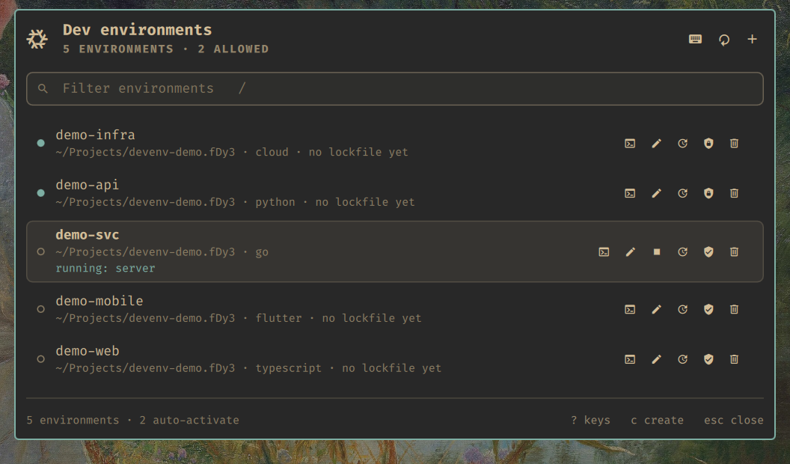
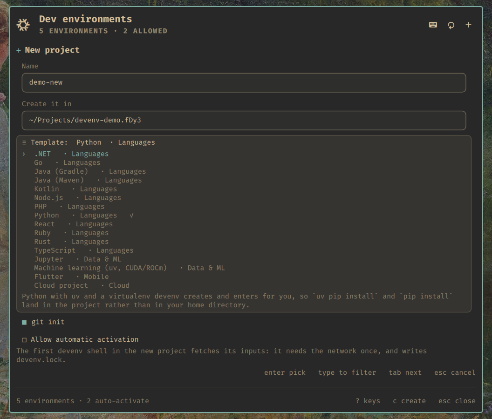
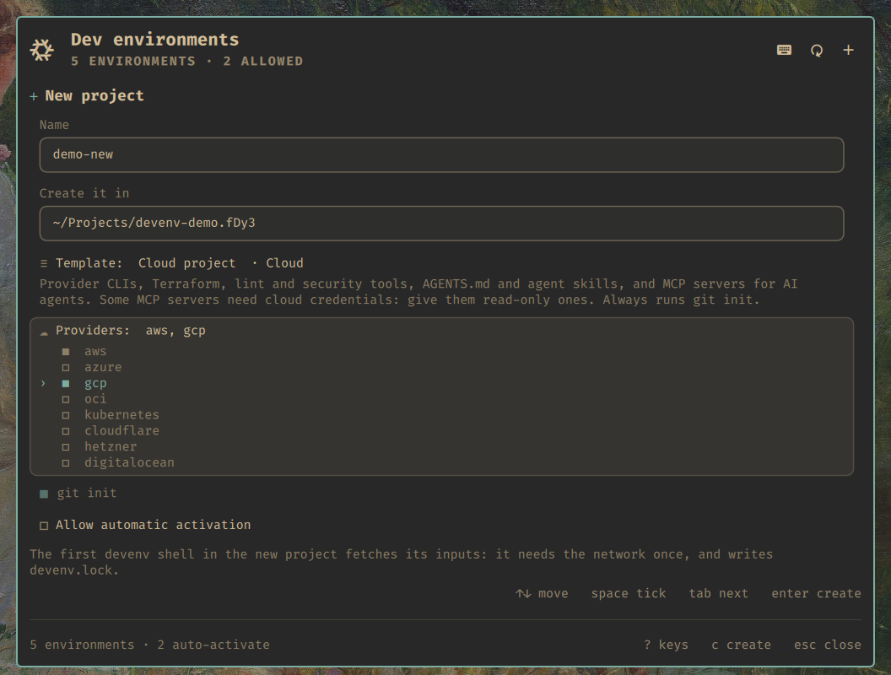
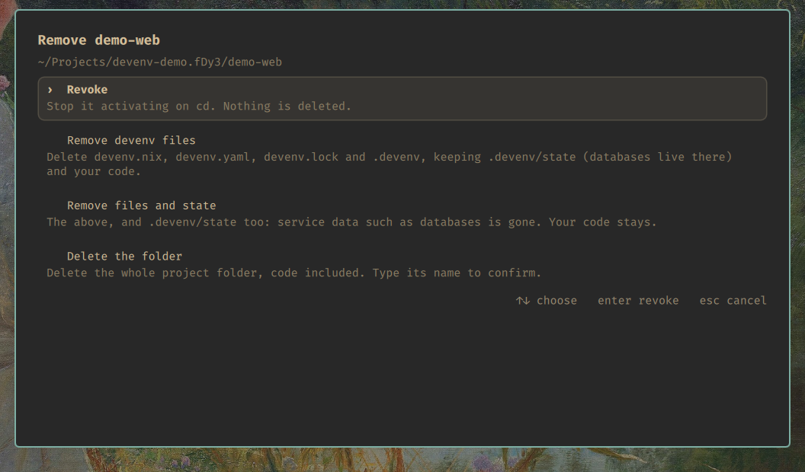
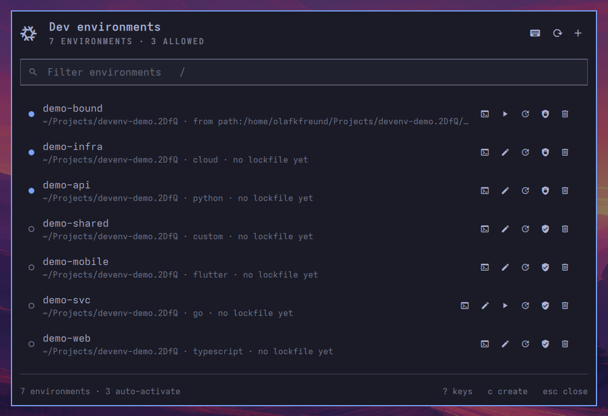
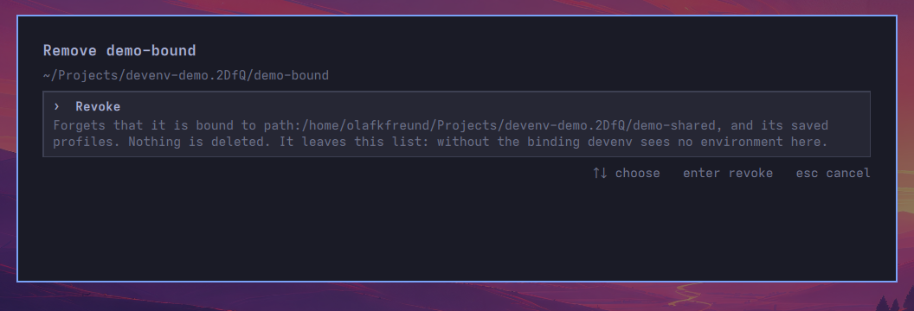

[devenv](https://devenv.sh) environments for the [Omarchy](https://omarchy.org)
shell on [nixarchy](https://olafkfreund.github.io/nixarchy/). This plugin puts
every project you have on the bar and behind **Super+Alt+E**. A new one, in any
of sixteen stacks, is a form away.

<figure class="shot">
  <video controls autoplay muted loop playsinline preload="metadata" aria-label="Recording of creating a Python project from the menu and entering it">
    <source src="img/rec-create.webm" type="video/webm">
    <source src="img/rec-create.mp4" type="video/mp4">
  </video>
  <figcaption>Creating a project from the keyboard: <kbd>c</kbd>, a name, a template, <kbd>enter</kbd>. The project is listed a moment later, and <kbd>enter</kbd> opens <code>devenv shell</code> in it.</figcaption>
</figure>

## Who it is for

You use devenv: a `devenv.nix` per project, with its languages, tools, services
and processes pinned by a lock. You have a dozen of these across your source
folders, and you would rather press a key than remember which one is where,
which is allowed, and which has a database running.

## The problem

devenv is a command line, one project at a time:

```
cd ~/Source/GitHub/api && devenv shell       # which folder was it?
devenv up -d                                 # is it already running?
devenv processes down
devenv update
devenv allow                                 # or was it revoke?
```

On nixarchy it was also split in two. Language presets lived inside nixarchy
(`nixarchy dev init python`), so a new template meant a nixarchy release. The
cloud templates lived in their own repository, and there was no Java, Kotlin,
.NET or mobile template anywhere. Nothing listed the projects you had.

## What it does

<figure class="shot">
  
  <figcaption>The menu: allowed projects first, then the most recently edited. A filled dot means it activates on <code>cd</code>. The row under the cursor says whether its processes are running.</figcaption>
</figure>

- **List.** Every `devenv.nix` under your project roots, plus anything you have
  allowed elsewhere.
- **Enter and edit.** <kbd>enter</kbd> opens `devenv shell` in a new terminal,
  in the project. <kbd>e</kbd> opens `devenv.nix` in your editor.
- **Processes.** <kbd>s</kbd> starts them with `devenv up -d` and stops them
  again. Stop is never locked out.
- **Update.** <kbd>g</kbd> runs `devenv update`, with the log in the panel.
- **Allow or revoke** automatic activation with <kbd>a</kbd>. Nothing is ever
  allowed behind your back.
- **Remove** in four steps, least destructive first. Each step says what it
  keeps.

<div class="shot-pair">
<figure class="shot">
  
  <figcaption>The create form. Templates are grouped, and typing filters them.</figcaption>
</figure>
<figure class="shot">
  
  <figcaption>Cloud projects: tick one provider or several.</figcaption>
</figure>
</div>

## Sixteen templates

| Group | Templates |
| --- | --- |
| Languages | Node.js, React, TypeScript, Python, Go, Rust, Java (Gradle), Java (Maven), Kotlin, .NET, PHP, Ruby |
| Data & ML | Machine learning (uv, CUDA/ROCm), Jupyter |
| Mobile | Flutter |
| Cloud | [cloud-projects-templates](https://github.com/olafkfreund/cloud-projects-templates): AWS, Azure, GCP, OCI, Kubernetes, Cloudflare, Hetzner, DigitalOcean |
| Yours | any folder in `~/.config/nixarchy-devenv/templates/` |

Each language template is a handful of devenv option lines, the same lines
devenv's own documentation shows. There is nothing of nixarchy's in your
project, and nothing a teammate without nixarchy cannot read. Before a release,
every one of them is scaffolded and evaluated against a real devenv.

## Removing, carefully

<figure class="shot">
  
  <figcaption><kbd>x</kbd> starts on the choice that deletes nothing. <code>.devenv/state</code>, where a database keeps its data, goes only if you ask for it. The folder goes only if you type its name.</figcaption>
</figure>

The command that deletes checks everything again right before it acts. It
refuses:

- a path that is not canonical;
- your home directory, or a project root;
- a folder without its own `devenv.nix`;
- a folder that moved device since it was listed;
- anything whose processes are running, or might be.

## Bound environments

A directory bound with `devenv --from <source> allow` has an environment but
no `devenv.nix` of its own: its configuration lives somewhere else. It is in
the list anyway, reading **from &lt;source&gt;** where a template would be.

<figure class="shot">
  <video controls muted loop playsinline preload="metadata" aria-label="Recording of a bound environment: listed with its source, removal offering only revoke, a shell from the bound configuration, and revoking it">
    <source src="img/rec-bound.webm" type="video/webm">
    <source src="img/rec-bound.mp4" type="video/mp4">
  </video>
  <figcaption><code>demo-bound</code> has no <code>devenv.nix</code>; it is bound to <code>demo-shared</code>. <kbd>x</kbd> offers revoke only. <kbd>enter</kbd> opens its shell, and <code>hello</code> answers from <code>demo-shared</code>'s configuration. Revoking it from the menu forgets the binding, and the row leaves the list.</figcaption>
</figure>

<figure class="shot">
  
  <figcaption>The bound row has no edit button: there is no <code>devenv.nix</code> here to edit.</figcaption>
</figure>

<figure class="shot">
  
  <figcaption>Nothing to delete, so one choice. Revoke says what else it forgets.</figcaption>
</figure>

## How it works

The plugin is a Quickshell QML surface. All of its logic is in one tested
JavaScript file, and it never touches a project directory itself. A small
command, `nixarchy-devenv`, does the listing, creating, status and removal, and
answers in JSON. You can use the same command in a terminal, and on nixarchy
it is `nixarchy dev init`.

## Set it up

On nixarchy it is on by default. Anywhere else with Nix:

```nix
inputs.nixarchy-devenv.url = "github:olafkfreund/nixarchy-devenv";
```

The flake has three outputs: `packages.<system>.cli` (the command),
`packages.<system>.plugin` (the plugin folder) and
`homeManagerModules.default` (the key). Without Nix:

```console
$ omarchy plugin add https://github.com/olafkfreund/nixarchy-devenv
```

The [manual]({{ '/usage/' | relative_url }}) has the rest: requirements, every
key, your own templates, settings and troubleshooting.
